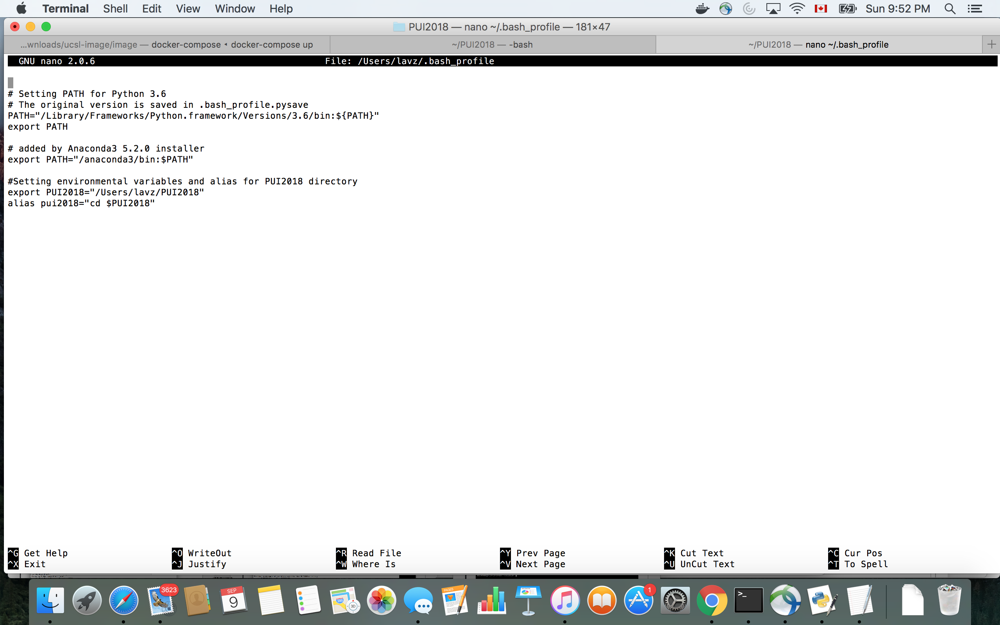
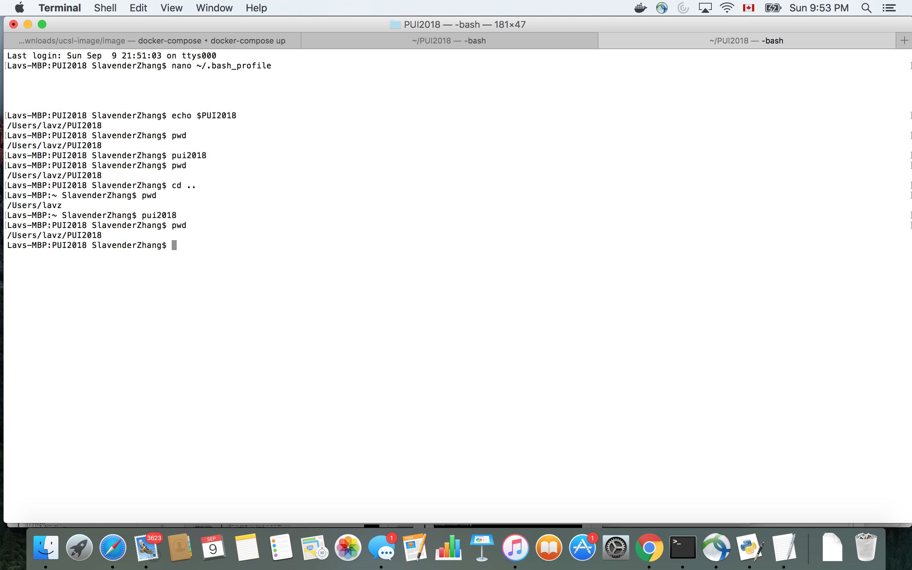

# Homework 1 - Forking, Merging, and Conflict Resolution
I created the account gittest_sz2404 for testing forking, merging, and conflict resolution functions. 

I worked with Chang (Angel) Liu on this part for experimenting fork. 

I messed with Chang (Angel) Liu’s repo: https://github.com/AngelLau/gittest_AngelLau

Angel also messed with my gittest_sz2404 repo. 

Special thanks to my TA, Fu Shang for answering my question and explaining git push function. 

# Homework 2 - PUI2018 Repository
I created a new repository following the instruction and using the methods from the lab.
  1. Create the PUI2018_sz2404 web repository, a README.md for stating the purpose of this repo, and the HW1_sz2404 folder.
  2. Open my terminal. 
  3. Use the mkdir command to create the new directory on my local machine. 
  4. Use the cd command to get into the folder and git init command for remote initialization.
  5. Use the touch command to create a random testing file (new.txt) for push purposes (so the directory I want to push for is not empty; thanks to FU explaining this to me). 
  6. Use command git remote add origin https://github.com/sz2404/PUI2018_sz2404.git AND git push -u origin master to establish the connection. 
  7. Use cd to get into the HW1 folder and use touch README.md to create the homework file (which is this file) and git add command to inject it into the repo. 
  8. After finishing editing the file, use the git commit command and git push command to have the file updated online/sync
  9. Use git rm command to delete the random testing file (new.txt), commit this action (git commit -m) and push this operation (git push). This step is to keep the folders clean. 

## Last Week's assignment demonstration:

The following parts demonstrates creating environmental variables and alias.
I followed the instructions from the previous assignment, located here: 
https://github.com/fedhere/PUI2018_fb55/blob/master/HW1_fb55/HW1_2_instructions.md

I used the export function to create the environmental variables, and I used the alias function to create a alias which is a shortcut to access my PUI2018 folder. Here are the steps:

  1. Use nano command (nano ~/.bash_profile) to access the profile page
  2. Use export command (export PUI2018=“/Users/lavz/PUI2018”) to set up an environmental variable for the PUI2018 directory
  3. Use alias command (alias pui2018=“cd $PUI2018”) to create an alias command as a shortcut to access the PUI2018 directory

Here is my bash_profile:

And here are the testing results for my environmental variables and alias

The testing results show that pui2018 as an alias has been set up that directs to the PUI2018 directory. 

# Homework 3 - Reproducible Research Code

I finished the extra credit last week and have submitted the Python notebook to NYU Class. I have also uploaded it into the HW1_sz2404 folder, under the name of ‘HW1_3_instructions_sz2404_Final.ipynb’. 

