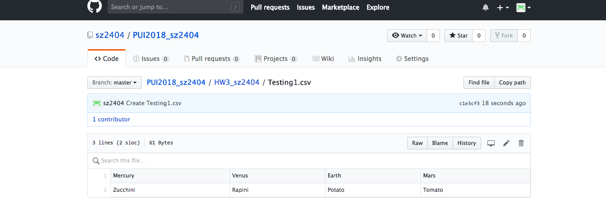
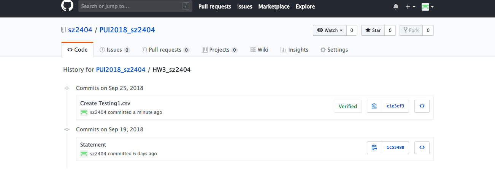

# Homework 2 - Part 1
Perform the instruction in deleteData.md: delete data and its history from a GitHub repo.
I created a random txt file called Testing1. txt. Then I followed Dr. Bianco's lab found [here](https://github.com/fedhere/PUI2018_fb55/blob/master/HW3_fb55/deleteData.md) to force delete the file and it's traces in the history. 

Here's the screenshot of the file I created:

The repo before deleting the testing file:

The history of HW3_sz2404 before deleting the testing file:

Here's the commands I used in the terminal for erasing the file and the history:

The repo after deleting the testing file:

The history of HW3_sz2404 after deleting the testing file:

The history section of HW3_sz2404 does not have trace of this file (Testing1.txt) being added and deleted. 

# Homework 2 - Part 2
In this section, I am using the Tonnage Data collected by DSNY. 

I mostly followed Professor Bianco's commands from the [Assignment2_example](https://github.com/fedhere/PUI2018_fb55/blob/master/HW3_fb55/Assignment2_example.ipynb). 

Regarding displaying columns and displaying top rows etc. For dropping columns, I used the drop() command. 

The plot shows a positive correlation between trash collected and paper recycled.

# Homework 2 - Extra Credit
### JSON file reading: 
The reading JSON part, I followed Professor Bianco's instruction, obtained the link from SODA API for the JSON file then used the pandas JSON reading function to structure the dataframe for the DSNY data. 

### Ploting numerical information against date:
For ticks rotation, I customized the rotation angle. Instead of using 90 degrees since sometimes 90 degress maybe hard for the readers to read it (turning head is not super comfortable), I used angle between 40 to 60 so no head turning is necessary to reading the ticks. 
#### Tonnage data plotting
The plotting date against another number part, I sticked to the tonnage data because it included dates (Year/Month). I plotted the monthly recycled paper weight per community against month.

#### Watershed data plotting
I also picked up another dataset, "Watershed Water Quality Data" to practice the functions and plotting. Data can be accessed [Here](https://data.cityofnewyork.us/Environment/Watershed-Water-Quality-Data/y43c-5n92/data)

In this part, I repeated the procedures above but for dropping columns, I followed professor's instructions to select the two needed columns instead of dropping others. 

I plotted the Turbidity collected at selected sites around 8AM against the date of collection. 

# Homework 2 - Part 3
For this part, I referred to professor's practices in the [APIreadingJson.ipynb](https://github.com/fedhere/PUI2018_fb55/blob/master/Lab3_fb55/APIreadingJson.ipynb). 

After initial completion, I realized my code works for buses running on regular services. However, when I tested on some buses (such as M34, M23 etc.) that are on "Selected Bus Services", it returned an error because the JSON data structure is different (they do not have actual data; missing key 'VehicleActivity' in the JSON file). However, not every single bus that is on 'Selected Bus Services' would have no read-time data. 

Therefore, I structured the code with 2 "try and except statements" to cover different situations:
1. Some Select Bus Lines (possibly services interruption) have different data structure or no data. The first try and except statements are trying to seperate the different outputs for regular running buses and some interrupted service. Interrupted service bus with no real-time data will return with a result of 'No Active Bus' plus Bus Number and Active Bus Number. 

2. Sometimes, there will be no information for the location as buses are possibly not running. The second try and except statements are set up under the 'for loop' to display bus that do not have valid location data.

To find out which bus is on 'Select Bus Service': http://web.mta.info/nyct/service/bus/mhtnsch.htm

JSON files are complicated and needs to learn the data structure. I referred to [This link](https://developer.rhino3d.com/guides/rhinopython/python-dictionary-database/) for interpreting how {} and [] are used in structuring the file. 

# Homework 2 - Part 4
For this part, I built in based on the existing code I wrote in Part 3. 

Regarding creating CSV file and write lines, I referred to professor's code [here]( https://github.com/fedhere/PUI2018_fb55/blob/master/Lab3_fb55/aSimplePythonThatWritesToCSV.py)

At the end, I used the writelines function at the end to display the information in the CSV file. The command writelines, I referred to this [link](http://www.pitt.edu/~naraehan/python2/reading_writing_methods.html)

I included the Q102.csv as a sample of my bus information output.     

# Collaboration Statement:
Specials thanks to Ilyas Habeeb, Te Du, Chang (Angel) Liu and Alia Kasem:

I consulted Te Du (a previous CUSP student) to explain the for loop, the Try and Except function, numerical data (quantitative vs qualitative).

I discussed certain functions, i.e. if statement, write function, with TA Ilyas Habeeb. Ilyas also explained Part 4 of the homework and the rotation for ticks in plotting function as well the instructions for the Extra Credit section. I brought up the Select Bus Services issue to Ilyas. Ilyas suggested that the py script should cover situations where bus data is not available following running bus format and suggested using if functions to cover different situations. 

I also discussed the assignment instructions as well NYC Open Data with Angel Liu and Alia Kasem. After the conversation with Ilyas, Angel and I had a discussion about the data structure of Select Bus Services and how to use Try & Except function and If statement to cover this situation. 

# Other Links Refered:

For figure size setting, I referred to this link: 
https://matplotlib.org/api/_as_gen/matplotlib.figure.Figure.html

For making a list/tuples into a string through the join() function, I referred to this link:
https://www.quora.com/In-Python-how-do-you-convert-a-list-to-a-string

For if statements, I referred to this link:
http://anh.cs.luc.edu/handsonPythonTutorial/ifstatements.html

For xticks on plot setting, I referred to this link: 
https://www.oreilly.com/library/view/python-data-science/9781491912126/ch04.html

and 

https://stackoverflow.com/questions/46456179/matplotlib-is-ignoring-locator-params-nticks-command

For markdown files commands: 
https://github.com/adam-p/markdown-here/wiki/Markdown-Cheatsheet#links

